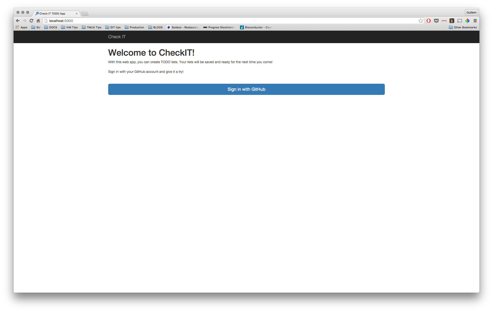
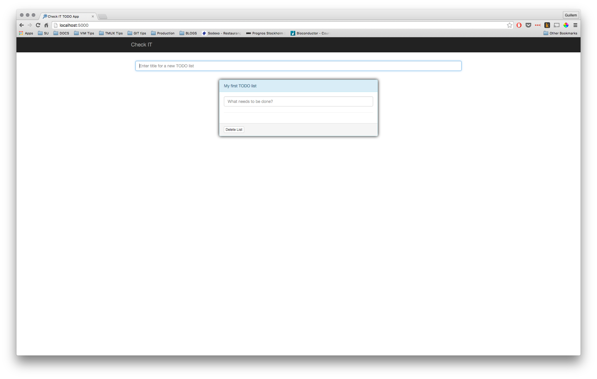
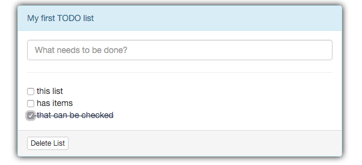

# Check It!

[](https://travis-ci.org/guillermo-carrasco/checkit)
[](https://coveralls.io/github/guillermo-carrasco/checkit?branch=master)

Check it is a TODO web app written in Python (Flask) and Angular.js.

## Deploy locally

1. Set up PostgreSQL
2. Create a [Github developer app][gh_devel], and register a new application. Both _Homepage URL_ and _Authorization callback URL_ should point to `http://localhost:5000/`. This will give you `Client id` and `Client secret`.
3. Create the following environment variables:
```bash
export DB_URI=postgresql://<postgreSQL_username>:<postgreSQL_password>@<postgreSQL_address>/checkit
export GITHUB_CLIENT=<your_gh_client_id>
export GITHUB_SECRET=<your_gh_client_secret>
```
5. Edit `checkit/server/static/js/app.js` with the correct clientId;
4. `pip install -e .`

### Run
Run `checkit` in the command line, the application should start.

NOTE: Before doing anything, create all the database schemas by making the following call: `curl -X GET http://localhost:5000/v1/1000fc1e-56dc-4a7d-add0-a83d1120c5d7` _(This will be automated in the future)_

## Features

* Log in with your GitHub account
* Automatically save newly created TODO lists and items in the database
* Check/Uncheck TODOs.
* Delete TODO lists

## Screenshots





[gh_devel]: https://github.com/settings/developers
